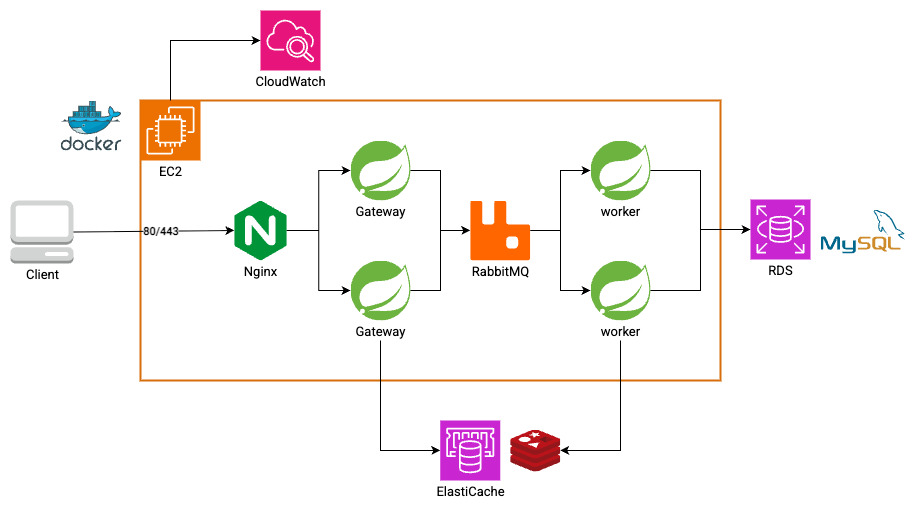

# 콘서트 예약 서비스 인프라 구성도

---

---
## 인프라 설명

### 개요
- 초기 구성은 `단일 EC2 인스턴스` + `docker-compose`로 운영 복잡도와 비용을 최소화합니다.
- Persistence 레이어는 백업 및 복구, 운영 편의성 등을 고려하여 관리형으로 분리합니다.
- 모든 애플리케이션 컴포넌트는 컨테이너로 운영되며, 추후 `Kubernetes`로의 확장이 용이합니다.
- 확장 시 `Nginx → ALB`, `RabbitMQ → Amazon MQ`로 분리할 수 있습니다.

### 구성요소
#### EC2
- 각 AWS 서비스를 따로 도입하는 것보다 단일 인스턴스에 컨테이너로 통합하는 편이 비용 효율적입니다.
- 콘서트 티켓팅 서비스는 트래픽이 특정 시간대에 집중되므로, 버스트형 인스턴스를 사용하는 것이 비용 대비 효율적입니다.
- `Nginx`는 TLS 인증, 간단한 로드밸런싱 및 레이트 리밋을 수행합니다.
- `Gateway`는 인증/인가, 요청 검증, 대기열 관리 등 클라이언트와 밀접한 작업을 처리합니다.
- `Worker`는 예약, 결제, 좌석 처리 등 주요 비즈니스 로직을 수행합니다.
- `RabbitMQ`는 예약 처리 이후 알림, 대기열 이벤트 등 비동기 작업을 큐 기반으로 처리하여 순간적인 트래픽 부하를 흡수합니다.

#### ElastiCache
- 엔진은 `Redis OSS`를 사용합니다.
- 멱등키, 대기열 토큰, 입장 순서 등을 관리합니다.

#### Amazon RDS
- 엔진은 `RDS for MySQL`을 사용합니다.
    - 이후 규모가 커지고, 고가용성/빠른 장애복구가 필요해지면 `Aurora MySQL`로 전환할 수 있습니다.
- 예약/결제 등의 핵심 데이터를 최종적으로 관리합니다.

#### CloudWatch
- EC2 인스턴스의 CPU, 메모리, 디스크 등 시스템 메트릭을 수집합니다.
- 애플리케이션 컨테이너 로그는 CloudWatch Logs로 전송하여 모니터링 및 검색이 가능합니다.
- Prometheus, Grafana 등을 직접 운영할 경우 인스턴스 리소스와 관리 비용이 증가하기 때문에, 초기에는 CloudWatch가 더 비용 효율적입니다.

### 보안 및 설정
- EC2 인바운드는 `80`/`443` 포트만 오픈합니다.
- RDS/ElastiCache 인바운드는 `EC2 Security Group`만 허용합니다.
- TLS는 `Certbot`을 활용해 무료 SSL 인증서를 발급하고, 자동으로 갱신합니다.
  - 추후 Nginx를 ALB로 전환하면, `ACM`을 통해 관리할 수 있습니다.
- RabbitMQ는 외부 접근을 차단하고, `도커 네트워크`를 활용합니다.
