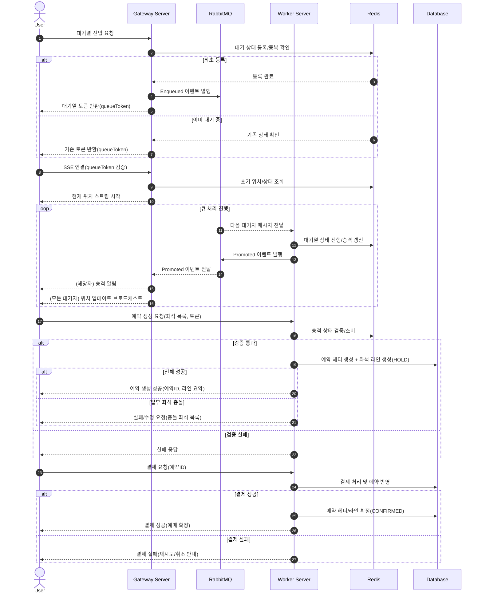

# 콘서트 예약 서비스 시퀀스 다이어그램

```mermaid
sequenceDiagram
    autonumber
    actor U as User
    participant GW as Gateway Server
    participant MQ as RabbitMQ
    participant W as Worker Server
    participant R as Redis
    participant DB as Database

%% A) 대기열 진입 & 토큰 발급 (+ MQ 등록)
    U->>GW: 대기열 진입 요청
    GW->>R: 대기 상태 등록/중복 확인
    alt 최초 등록
        R-->>GW: 등록 완료
        GW->>MQ: Enqueued 이벤트 발행
        GW-->>U: 대기열 토큰 반환(queueToken)
    else 이미 대기 중
        R-->>GW: 기존 상태 확인
        GW-->>U: 기존 토큰 반환(queueToken)
    end

%% B) 위치 스트림(SSE) 시작
    U->>GW: SSE 연결(queueToken 검증)
    GW->>R: 초기 위치/상태 조회
    GW-->>U: 현재 위치 스트림 시작

%% C) MQ 기반 진행 & 승격 (워커가 순서/속도 제어)
    loop 큐 처리 진행
        MQ-->>W: 다음 대기자 메시지 전달
        W->>R: 대기열 상태 진행/승격 갱신
        W->>MQ: Promoted 이벤트 발행
        MQ-->>GW: Promoted 이벤트 전달
        GW-->>U: (해당자) 승격 알림
        GW-->>U: (모든 대기자) 위치 업데이트 브로드캐스트
    end

%% D) 입장 후 예약 생성(헤더/라인)
    U->>W: 예약 생성 요청(좌석 목록, 토큰)
    W->>R: 승격 상태 검증/소비
    alt 검증 통과
        W->>DB: 예약 헤더 생성 + 좌석 라인 생성(HOLD)
        alt 전체 성공
            W-->>U: 예약 생성 성공(예약ID, 라인 요약)
        else 일부 좌석 충돌
            W-->>U: 실패/수정 요청(충돌 좌석 목록)
        end
    else 검증 실패
        W-->>U: 실패 응답
    end

%% E) 결제
    U->>W: 결제 요청(예약ID)
    W->>DB: 결제 처리 및 예약 반영
    alt 결제 성공
        W->>DB: 예약 헤더/라인 확정(CONFIRMED)
        W-->>U: 결제 성공(예매 확정)
    else 결제 실패
        W-->>U: 결제 실패(재시도/취소 안내)
    end
```